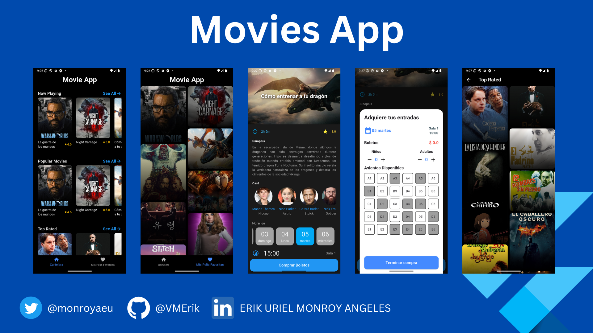

# Movies App

Maquetacion de aplicación movil para consultar informacion de peliculas.
Esta documentación detalla la configuración, dependencias y estructura básica del proyecto.

✅ Usamos GoRouter como sistema de navegacion y el uso de objetos como parametros compartidos entre paginas.

✅ Hacemos uso del paquete http para peticiones rest a un servicio externo.

✅ Integracion de APIs de terceros, en este caso themoviedb

✅ Utilizamos el paquete flutter_staggered_grid_view para la presentacion de nuestras peliculas en una estructura de Grid, similar a Instagram, Pinterest, Etc...

✅ Uso de dotenv para nuestras variables de entorno y no exponer directamente nuestra API KEY.


## 📦 Información del Proyecto

| Campo         | Valor                  |
|---------------|------------------------|
| **Nombre**    | MoviesApp           |
| **Descripción** | Maquetacion de aplicación movil para consultar informacion de peliculas.|
| **Versión**   | 0.1.0                  |
| **SDK**       | Flutter 3.7.2          |
| **Publicación** | No se publica (`publish_to: none`) |


## 📁 Estructura del proyecto

```plaintext
/lib
  /models         # Modelos de datos 
  /pages          # Vistas de la aplicación
  /routes         # Configuracion de Rutas con GoRoute
  /services       # Llamadas a nuestra api externa
  /widgets        # Componentes reutilizables

/assets
  /img             # Imágenes usadas en la app
```

## ▶️ Cómo iniciar el proyecto 
```flutter pub get``` 
```flutter run ``` 


## 📷 Vista previa de vistas
